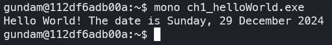
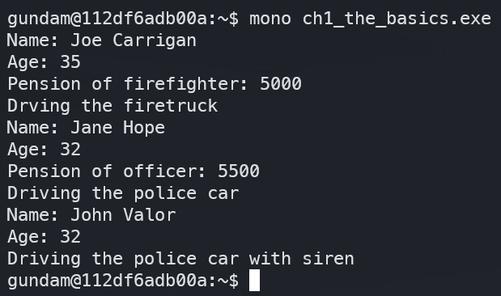

# grayhat_csharp
Repo to follow along with Gray Hat C#

## Chapter 1 - C# Crash Course

Following along the book requires some leaps of faith and quite a bit of self discovery to figure out what files should be named, and what commands are used to compile code.

To make the learning process easier on myself, I created a Dockerfile and Makefile system that should help automate this process.

Initial build of the image is very long (all the required parts for mono), but adding subsequent C# projects to compile only takes seconds.

Example output from the docker image below run `make build_ch1` and `make test_ch1` to create the image and instantiate the terminal.

Execute the `exe` files with `mono` per the screenshots below

### helloWorld

### theBasics
